# SimChat Mermaid Chart System

Simplified workflow: Domain charts → JSON files + Master chart

## Quick Start

```bash
# Create/edit domain chart with simple node IDs
nano my_domain/chart.mmd

# Sync: Create JSON scaffolds + add animations to domain chart
uv run python generate_mermaid.py sync

# Fill in JSON files with dialogue content

# Generate: Build master chart from all domain charts
uv run python generate_mermaid.py generate
```

## Chart Structure

```
simchat/
├── generate_mermaid.py         # Sync/generate script
├── simchat_flow.mmd             # Master chart (auto-generated)
├── usspinspectorwillard/
│   ├── chart.mmd                # Domain chart (you edit this)
│   ├── intro.json               # Dialogue files (you fill these in)
│   └── decline.json
└── another_domain/
    ├── chart.mmd
    └── *.json
```

## Domain Chart Format

Simple node IDs (no folder prefix, no subgraphs):

```mermaid
flowchart LR

n_intro(intro — Willard):::n_entity_willard
n_decline(decline — Willard):::n_entity_willard
n_accept(accept — Willard):::n_entity_willard

n_intro e0@-- "Sure" --> n_accept
n_intro e1@-- "No thanks" --> n_decline
n_decline e2@-- "Changed my mind" --> n_intro
```



**Node format**: `n_<filename>(<display label>):::<css_class>`
**Edge format**: `n_source e<num>@-- "<button label>" --> n_target`

**Emoji prefixes** (auto-detected):
- 📦 = Has `itemsInput`/`itemsOutput` in JSON
- 🔀 = Has `condition` in JSON
- ⚙️ = Has `commands` in JSON

## Commands

### Sync

```bash
uv run python generate_mermaid.py sync
```

For each domain chart:
1. Creates JSON scaffolds for missing nodes
2. Reports orphaned JSON files (not in chart)
3. Adds animation lines to domain chart

### Generate

```bash
uv run python generate_mermaid.py generate
```

Reads all domain charts → generates master chart with:
- Prefixed node IDs: `n_<domain>_<filename>`
- Subgraphs per domain
- Deterministic entity colors
- Edge animations

## Workflow Example

1. **Create domain chart**:
   ```bash
   mkdir traders_guild
   nano traders_guild/chart.mmd
   ```

2. **Add simple nodes**:
   ```mermaid
   flowchart LR
   n_greeting(greeting — Merchant):::n_entity_merchant
   n_shop(shop — Merchant):::n_entity_merchant
   n_greeting e0@-- "Browse wares" --> n_shop
   ```

3. **Sync to create JSON**:
   ```bash
   uv run python generate_mermaid.py sync
   ```
   Creates: `traders_guild/greeting.json`, `traders_guild/shop.json`

4. **Edit JSON files** - fill in dialogue text, items, conditions

5. **Generate master chart**:
   ```bash
   uv run python generate_mermaid.py generate
   ```
   Adds `traders_guild` subgraph to `simchat_flow.mmd`

## JSON File Structure

Generated scaffold:

```json
{
  "entityId": "traders_guild",
  "entityName": "Merchant",
  "text": "TODO: Add dialogue text for traders_guild/greeting",
  "actions": [
    {
      "label": "Browse wares",
      "nextState": "ptd_trading:traders_guild/shop"
    }
  ]
}
```

Add `itemsInput`, `itemsOutput`, `condition`, `commands` as needed.

## Master Chart

Auto-generated from domain charts. Do not edit directly - regenerate with `generate` command.

Example output:

```mermaid
flowchart LR

subgraph n_g_traders_guild["Traders Guild (traders_guild/*)"]
  n_traders_guild_greeting(greeting — Merchant):::n_entity_traders_guild
  n_traders_guild_shop(shop — Merchant):::n_entity_traders_guild
end

n_traders_guild_greeting e0@-- "Browse wares" --> n_traders_guild_shop

    %% Entity color classes
    classDef n_entity_traders_guild stroke:#ed2a9c,stroke-width:3px,rx:12

    %% Animate all edges
    e0@{animate: true}
```



## Notes

- Domain charts use simple IDs (`n_intro`) for easy editing
- Master chart uses prefixed IDs (`n_domain_intro`) for uniqueness
- Entity colors are deterministic (hash-based) from domain folder name
- Orphaned JSON files are reported but not automatically deleted
- Edge animations are automatically added to domain charts
- No automatic editing of domain charts except animation section
